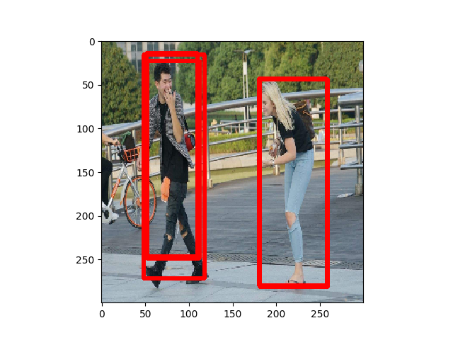

# NPU_CaffeSSD
RK3399 Pro NPU support for Caffe SSD detector


Assume you have installed RKNN convert tool 

or you can install it first by 

```
$ pip install rknn_toolkit-0.9.9-cp35-cp35m-linux_x86_64.whl
```


## Usage
<b>get priorbox of ssd detector<b/>
  
```
$ python priorbox.py
```

<b>convert model and run pedestrian detect<b/>
  
```
$ python3.5 npu_ssd_det.py
```

## Result

<p align="center">
    
</p>
